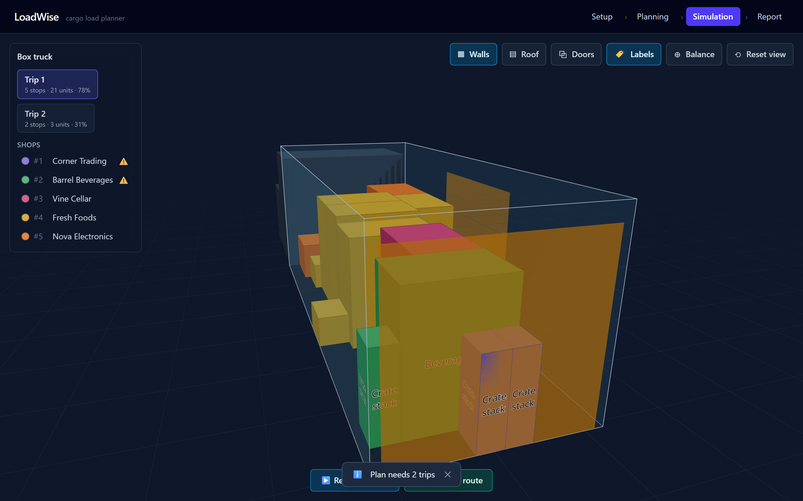
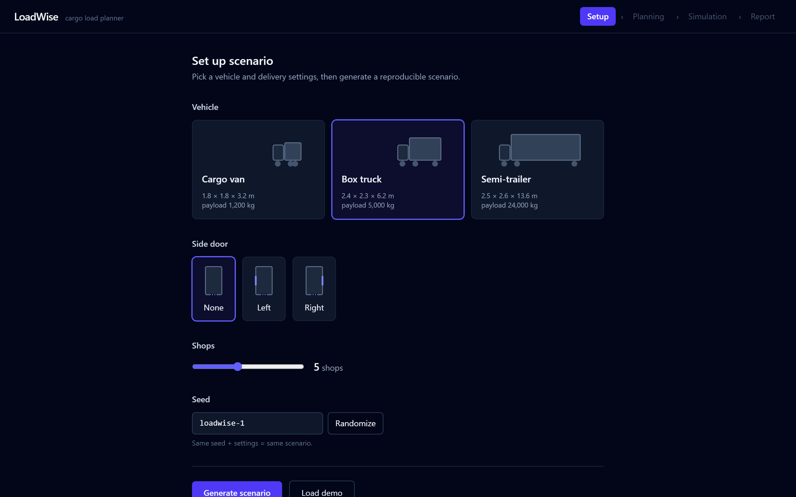
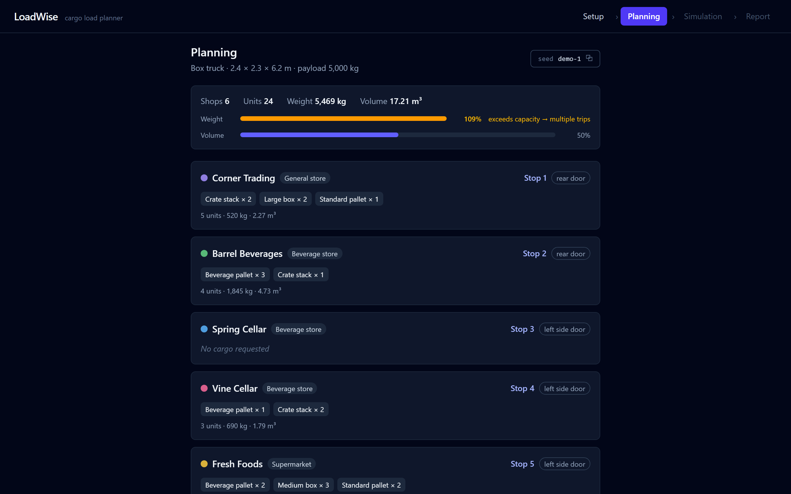
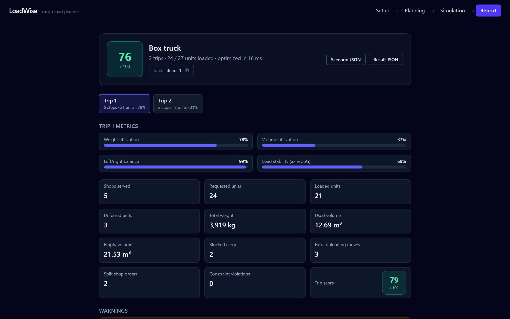

# LoadWise 🚚

**Plan how cargo loads into a delivery vehicle, and watch every trip in interactive 3D.**

LoadWise is a frontend-only web app. A deterministic heuristic optimizer decides
how boxes pack into a van, box truck or semi-trailer across one or more trips —
respecting weight, stacking, door access, delivery order and axle limits — then
renders the whole plan in 3D: the loading sequence, a stop-by-stop delivery
simulation, and a metrics report. No backend, no API keys, no LLM in the loop.

**▶ Live demo:** **https://loadwise-chi.vercel.app/** — click **Load demo** for a
one-click walkthrough. (Auto-deployed from `main` via Vercel; every PR also gets
its own preview URL.)



---

## What it does

Real load planning is not "best possible 3D packing." An operator cares whether
the last stop is reachable without unpacking half the truck, whether the axles
are legal, and whether the plan is safe to drive. LoadWise is built around that:

- **Cargo-first, multi-trip planning.** Generate 3–8 shops of realistic cargo,
  pick a vehicle, and the optimizer places every box — automatically spilling
  into a second, third… trip when one won't hold everything.
- **Delivery-order aware.** Cargo is loaded back-to-front so the first stop
  unloads first (LIFO), through the rear **or** a side door when the shop
  prefers it. Blocked-cargo and rehandle counts are surfaced, not hidden.
- **Physically honest.** Every placement is validated for overlap, support
  (≥70% base), stacking rules and payload. Axle loads (front/rear beam,
  kingpin/trailer for the semi) are estimated and hard-capped; the plan warns
  when a load becomes rear-heavy or unsafe *after a delivery stop*, and quantifies
  the lashing needed against braking. All labeled **planning estimates**, never
  legal checks.
- **Explained, not just drawn.** A deterministic report scores each trip and
  spells out every warning in plain language.

| Setup | Planning |
|---|---|
|  |  |
| **Simulation** | **Report** |
|  |  |

## Demo mode

Click **Load demo** on the Setup screen for a curated, reproducible walkthrough:
a box truck with a left side door and 6 shops. Hit **Optimize** and it reliably
shows two trips, side-door loading, all six cargo categories and a deferred item.
It uses the fixed seed `demo-1` ([`src/fixtures/demoConfig.ts`](src/fixtures/demoConfig.ts),
picked by [`scripts/findDemoSeed.ts`](scripts/findDemoSeed.ts)). Any scenario is
reproducible from the seed shown on the Planning and Report screens.

## How it works

- **Deterministic optimizer.** Given a scenario, a greedy best-fit heuristic
  places cargo using extreme-point candidates + a weighted score (compactness,
  floor preference, weight/axle balance, door accessibility, delivery-order
  compatibility, support quality). Every placement is checked against the T05
  validator; only slots with a **clear loading route** past already-placed cargo
  are committed, so the loading order is physically executable. Overflow spills
  into new trips up to a cap.
- **Determinism.** Scenario generation flows through a seeded RNG — no
  `Math.random`, no `Date.now` in the domain layer (ESLint-enforced). Same seed +
  config ⇒ byte-identical shops, plan and report, every run. Scenarios and
  results export as JSON from the report.
- **Web Worker.** Optimization runs off the main thread with progress + cancel;
  stale responses are dropped by request id, so the UI never blocks or renders a
  superseded result.
- **Units & coordinates.** The domain is integer centimetres; the origin is the
  rear-left-bottom inside corner (+X left→right, +Y floor→roof, +Z rear→cabin).
  The cm→metre conversion happens **only** in the 3D layer.

## Architecture

```text
src/
  types/        # shared domain contract (geometry, vehicle, cargo, optimization)
  utils/        # seeded RNG, formatting, download — pure helpers
  fixtures/     # hand-authored demo scenario + config
  features/
    scenario/   # seeded scenario generation
    vehicles/   # vehicle catalog + axle geometry (static data)
    cargo/      # cargo templates (static data)
    optimizer/  # validation, placement heuristic, multi-trip planner,
                #   reachability, axle physics, metrics/score/warnings
    reports/    # metrics, score, warnings (pure)
  workers/      # optimizer Web Worker + typed client
  state/        # Zustand stores (scenario, optimization, ui, toasts)
  components/   # screens (setup / planning / simulation / report) + UI
  three/        # R3F scene, cargo meshes, doors, loading + delivery animation
```

The optimizer and everything under `features/` import **no** React or Three.js —
pure functions, which is what makes them worker-safe and unit-testable.

## Quality gates

`typecheck` · `lint` · **356 unit tests** (incl. a full-pipeline
[invariant suite](src/features/optimizer/invariants.test.ts) over 120
seed×vehicle×door combinations and [integration hardening](src/features/integration.test.ts)
for every edge case) · a [Playwright smoke test](e2e/smoke.spec.ts) of the demo
walkthrough. All green in CI.

## Quickstart

```bash
npm install
npm run dev        # Vite dev server
```

```bash
npm run build      # typecheck (tsc -b) + production build
npm run preview    # preview the production build
npm run test       # unit tests (vitest)
npm run test:e2e   # Playwright smoke (builds + previews first)
npm run typecheck  # type-check without emitting
npm run lint       # eslint
```

## Tech stack

React 19 + TypeScript (strict) + Vite · React Three Fiber + drei · Zustand ·
Tailwind CSS v4 · Vitest + Playwright · deployed on Vercel.

## Team

Built as a 48-hour hackathon MVP by Ivan Mitovski, Daniel Dimitrov and
Slavey Dikovski — three developers working in parallel across the domain/optimizer,
3D/animation and UI/state tracks (see [docs/TASKS.md](docs/TASKS.md)).

## Docs

- [idea.md](idea.md) — full product spec (source of truth)
- [docs/DEMO.md](docs/DEMO.md) — 3-minute demo script
- [docs/PLAN.md](docs/PLAN.md) — 48h execution plan
- [docs/TASKS.md](docs/TASKS.md) — task board
- [CLAUDE.md](CLAUDE.md) — conventions & workflow for Claude Code sessions
